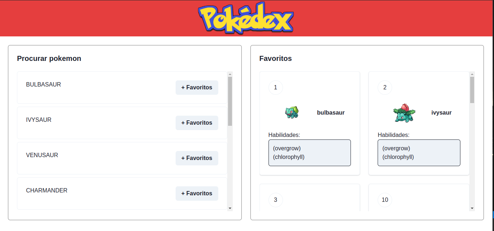

# PokeAPI FullStack Test

Demo de uma Pokedex para salvar sua lista de Pokemons favoritos



## Como executar?

### Server

- Para executar o servidor Spring Boot, entre na pasta ```./server```

- Após, com o maven instalado, execute o comando no terminal:

```
  mvn spring-boot:run
```

### Client

- Para executar o cliente React, entre na pasta ```./client```

- Após, com o npm instalado, instale as dependências do projeto:

```
  npm install
```
- Depois, execute:

```
  npm run dev
```

## Documentação da API

- Entre na documentação para ver os endpoints [aqui](http://localhost:8080/docs-pokeapi.html)